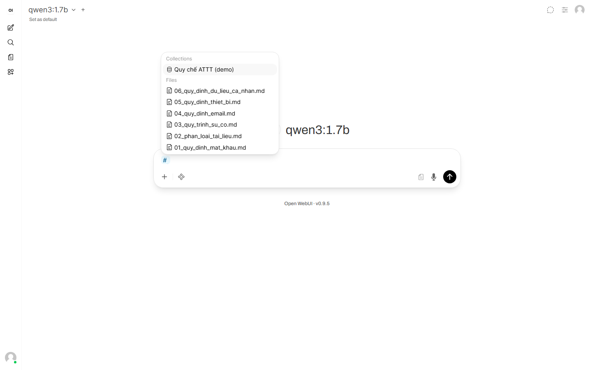
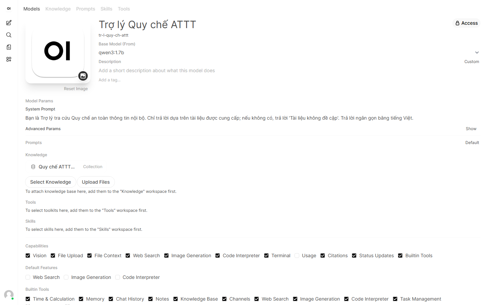

# Hướng dẫn cho học viên — Local LLM · RAG (Open WebUI)

> Tài liệu này được sử dụng khi tiến độ thực hành trên lớp không theo kịp, hoặc khi một thuật ngữ hay một bước thao tác chưa rõ. Không bắt buộc đọc tuần tự; tra cứu đúng mục cần thiết.
> Nội dung khớp với buổi workshop: xây dựng trợ lý RAG chạy hoàn toàn trên máy cục bộ thông qua Open WebUI (không cần code).
> Quan trọng: Dữ liệu không rời khỏi máy. Cả LLM lẫn mô hình nhúng đều chạy cục bộ qua Ollama; tài liệu nạp vào Open WebUI không được gửi lên đám mây. Đây là lý do sử dụng RAG cục bộ thay vì dán nội dung vào ChatGPT.

## Mục lục
- Tóm tắt quy trình ↓
1. Phạm vi sử dụng tài liệu và Bảng thuật ngữ
2. Lý thuyết RAG (ngắn gọn)
3. Cài Ollama và chạy LLM cục bộ
4. Dùng Open WebUI cho RAG (chi tiết)
5. Xử lý lỗi thường gặp
6. Tài liệu liên quan

---

## Tóm tắt quy trình

> Năm bước dưới đây là quy trình tối thiểu để có một trợ lý RAG hoạt động (mỗi bước trỏ tới mục chi tiết tương ứng).
>
> 1. Cài và chạy Ollama, tải hai mô hình: `ollama pull qwen3:1.7b` và `ollama pull nomic-embed-text` *(mục 3)*.
> 2. Khởi động Open WebUI: trong thư mục repo, thực hiện `docker compose up -d`, sau đó mở `http://localhost:3000` (trường hợp cài bằng pip thì `http://localhost:8080`) *(mục 4.1)*.
> 3. Đổi mô hình nhúng sang chạy cục bộ — bắt buộc và phải thực hiện trước khi nạp tài liệu: Admin Panel → Settings → Documents → Engine = **Ollama**, Model = **nomic-embed-text** → Save *(mục 4.4)*.
> 4. Nạp tài liệu: tạo Knowledge base rồi upload (bộ mẫu có sẵn trong `2_rag/sample_upload/`) *(mục 4.3)*.
> 5. Truy vấn có trích nguồn: gõ `#` để chọn kho, sau đó đặt câu hỏi đầy đủ. Sự xuất hiện của mục **Sources** dưới câu trả lời xác nhận RAG đã hoạt động *(mục 4.6)*.
>
> Lưu ý: Nếu câu trả lời rất chậm, nguyên nhân thường là qwen3 đang ở chế độ "suy nghĩ"; thêm `/no_think` vào đầu câu hỏi hoặc tắt nút "Think" *(mục 5.8)*.

---

## 1. Phạm vi sử dụng tài liệu

Tài liệu này dùng để đọc thêm khi tiến độ thực hành trên lớp không theo kịp, hoặc khi gặp một thuật ngữ chưa hiểu. Đây không phải tài liệu cần đọc tuần tự từ đầu đến cuối; nên tra cứu đúng mục đang cần. Khi gặp một thuật ngữ lạ (ví dụ "embedding", "chunk", "top-k"), tra Bảng thuật ngữ bên dưới; khi gặp một bước thao tác, xem phần hướng dẫn từng bước tương ứng. Thời gian đọc lướt toàn bộ khoảng 15-20 phút.

### Bảng thuật ngữ

| Thuật ngữ | Nghĩa (dễ hiểu) |
|---|---|
| LLM (Large Language Model) | Mô hình ngôn ngữ lớn, được huấn luyện để hiểu và sinh văn bản; là "bộ não" trả lời câu hỏi. |
| Token | Đơn vị văn bản nhỏ mà mô hình xử lý (một từ thường tách thành 1-vài token); chi phí và độ dài đều tính theo token. |
| Context window | Lượng token tối đa mô hình "nhìn thấy" cùng lúc (câu hỏi + tài liệu + lịch sử); vượt quá sẽ bị cắt bớt. |
| Local / Offline | Chạy mô hình ngay trên máy cục bộ, không gửi dữ liệu lên mạng — riêng tư và không cần Internet. |
| Quantization | Kỹ thuật nén mô hình (giảm độ chính xác số) để chạy nhẹ hơn, tốn ít RAM hơn, đổi lại chất lượng giảm nhẹ. |
| Ollama | Phần mềm chạy LLM trên máy cá nhân; tải, quản lý mô hình và cung cấp API tại cổng 11434. |
| Docker | Công cụ đóng gói phần mềm kèm mọi thứ nó cần, để chạy giống nhau trên mọi máy. |
| Container | Một "hộp" cô lập do Docker tạo ra, chứa sẵn ứng dụng đang chạy (ví dụ Open WebUI). |
| Open WebUI | Giao diện web để trò chuyện với LLM và quản lý tài liệu, thao tác bằng chuột — không cần code. |
| RAG (Retrieval-Augmented Generation) | Kỹ thuật cho LLM truy hồi tài liệu trước rồi mới trả lời, giúp chính xác và giảm bịa. |
| Embedding | Cách biến một đoạn văn bản thành dãy số (vector) thể hiện ý nghĩa, để máy so sánh độ tương đồng. |
| Vector | Dãy số biểu diễn ý nghĩa của văn bản; hai văn bản gần nghĩa thì hai vector gần nhau. |
| Vector DB (ChromaDB) | Cơ sở dữ liệu lưu các vector và tìm nhanh những đoạn gần nghĩa nhất với câu hỏi. |
| Chunk / Chunking | Việc cắt tài liệu dài thành các đoạn nhỏ để nhúng và truy hồi chính xác hơn. |
| Overlap | Phần văn bản lặp giữa hai chunk liền kề, giúp không mất ngữ cảnh ở ranh giới cắt. |
| Top-k | Số đoạn gần nghĩa nhất được lấy ra để đưa cho LLM tham khảo (ví dụ top-k = 3 lấy 3 đoạn). |
| Knowledge base | Bộ tài liệu được nạp vào hệ thống làm nguồn truy hồi cho RAG. |
| System Prompt | Câu chỉ dẫn nền đặt sẵn cho mô hình, quy định vai trò và cách trả lời trong suốt cuộc trò chuyện. |

---

## 2. Lý thuyết RAG

### RAG là gì và vì sao cần

LLM được huấn luyện trên dữ liệu công khai — nó không biết tài liệu riêng (quy chế nội bộ, sổ tay, hợp đồng). Khi hỏi trực tiếp, mô hình có thể bịa trơn tru (hallucination). Còn nếu dán cả tập tài liệu vào câu hỏi thì vượt context window, tốn token và chậm.

RAG (Retrieval-Augmented Generation) giải quyết vấn đề bằng cách chỉ truy hồi đúng vài đoạn liên quan nhất rồi đưa cho LLM trả lời. Theo ẩn dụ: hỏi trực tiếp tương tự thi đóng sách (nhớ gì nói nấy); RAG tương tự thi mở sách — tra đúng trang rồi mới trả lời.

### Pipeline 6 bước

Quy trình gồm 4 bước OFFLINE (thực hiện một lần khi dựng kho) và 2 bước ONLINE (lặp lại ở mỗi câu hỏi):

| Pha | Bước | Việc làm |
|---|---|---|
| OFFLINE | 1. Load | Nạp tài liệu |
| OFFLINE | 2. Chunk | Cắt thành đoạn nhỏ |
| OFFLINE | 3. Embed | Biến mỗi đoạn thành vector mang nghĩa |
| OFFLINE | 4. Store | Lưu vector vào vector DB |
| ONLINE | 5. Retrieve | Truy hồi các đoạn gần nghĩa nhất với câu hỏi |
| ONLINE | 6. Generate | Đưa các đoạn cho LLM sinh câu trả lời |


### Embedding

Embedding biến một đoạn văn bản thành vector — dãy số mô tả ý nghĩa (`nomic-embed-text` cho vector 768 chiều; mô hình khác có thể nhiều hoặc ít hơn). Nguyên tắc cốt lõi: nghĩa gần nhau thì vector gần nhau trong không gian, đo bằng độ tương đồng cosine.

Cách này vượt trội so với tìm từ khóa: "mã đăng nhập" và "mật khẩu" khác hẳn về chữ nên tìm từ khóa sẽ trượt, nhưng gần nhau về nghĩa nên embedding vẫn khớp. Buổi học dùng mô hình `nomic-embed-text`, chạy hoàn toàn cục bộ.


### Chunking, Vector DB và Top-k

- Chunking: cắt tài liệu thành đoạn khoảng 500 ký tự, overlap khoảng 50 ký tự để không đứt ý ở ranh giới đoạn.
- Vector DB (ChromaDB): mỗi đoạn lưu đồng thời ba thứ — vector, văn bản gốc và metadata (ví dụ tên file); dùng thuật toán HNSW để tìm hàng xóm gần nhất rất nhanh dù có nhiều đoạn.
- Top-k: mỗi câu hỏi chỉ lấy `k` đoạn gần nghĩa nhất đưa cho LLM. Buổi học đặt k = 3.

### Giới hạn và Đánh giá

RAG không phải phép màu — nếu bước Retrieve truy hồi nhầm đoạn, LLM sẽ trả lời sai theo ("rác vào, rác ra"). Câu hỏi nằm ngoài tài liệu được chặn bằng System Prompt (yêu cầu chỉ dùng tài liệu, thiếu thì đáp "không đề cập").

Tiêu chí đánh giá quan trọng nhất là Faithfulness — câu trả lời bám sát nguồn, có trích dẫn, không thêm thông tin ngoài nguồn. Việc đầu tiên khi nhận một câu trả lời là mở Sources để xem nguồn. Đánh giá bài bản có thể dùng khung RAGAS để chấm điểm tự động.

---

## 3. Cài Ollama và chạy LLM cục bộ

Ollama là công cụ tải và chạy mô hình AI (LLM) ngay trên máy cục bộ. Chỉ cần vài lệnh, không cần biết code. Phần này thực hiện một lần duy nhất.

> Tự động hoá: Repo có sẵn script thực hiện toàn bộ các bước dưới đây (`setup.ps1` và `pull_models.ps1`). Cách chạy: mở PowerShell, `cd` vào thư mục repo, thực hiện `.\0_setup\setup.ps1` (nếu báo *"running scripts is disabled"* thì xem mục 5.1). Phần này giải thích từng lệnh thủ công để hiểu rõ khi script báo lỗi. Bảng lệnh gọn để copy-paste cho máy mới (Win/Mac) có trong `LENH_CAI_DAT_NHANH.md`.

### 3.1 Cài Ollama

Yêu cầu: RAM tối thiểu 8GB, ổ trống còn ≥ 5GB.

Mở terminal (Windows: chuột phải nút Start → *Windows PowerShell*; macOS/Linux: mở app Terminal), rồi nhập lệnh theo đúng hệ điều hành đang dùng.

> Lưu ý về Terminal trên Windows: nhấn **Start**, gõ "PowerShell", mở **Windows PowerShell** (cửa sổ nền xanh hoặc đen). Đây là nơi nhập lệnh rồi nhấn Enter. Chỉ nhập phần lệnh, không nhập ký tự nhắc đầu dòng (`>` hay `$`). Trên macOS: nhấn **Cmd+Space**, gõ "Terminal", nhấn Enter.

| Hệ điều hành | Lệnh cài |
|---|---|
| **Windows** | `winget install Ollama.Ollama` |
| **macOS** / **Linux** | `curl -fsSL https://ollama.com/install.sh \| sh` |

Cài xong, kiểm tra kết quả:

```bash
ollama --version
```

Nếu in ra một dòng số phiên bản (ví dụ `ollama version 0.x.x`) là đã cài xong.

> Trường hợp Windows báo `winget không nhận diện`: vào Microsoft Store cài *App Installer*, hoặc tải bản cài thủ công trực tiếp tại **ollama.com/download** rồi cài như phần mềm thông thường.

> Trường hợp sau khi cài lần đầu trên Windows mà gõ `ollama` báo lệnh không tồn tại: đóng cửa sổ PowerShell hiện tại (gõ `exit`), mở cửa sổ PowerShell MỚI, rồi thử lại. Nguyên nhân là máy cần nạp lại biến môi trường.

### 3.2 Lấy mô hình (tải mô hình về máy)

Chọn mô hình theo dung lượng RAM của máy. Chọn mô hình quá nặng so với cấu hình sẽ khiến hệ thống chạy rất chậm hoặc treo.

| RAM / Phần cứng | Model LLM | Dung lượng | Ghi chú |
|---|---|---|---|
| **8GB** (hoặc không có GPU) | `qwen3:1.7b` | ~1.4GB | Mặc định — dùng xuyên suốt workshop |
| **16GB** | `qwen3:4b` | ~2.5GB | Trả lời chất lượng hơn |
| **Có GPU rời** | `qwen3:8b` | ~5GB | Tốt nhất, cần máy mạnh |

Tải mô hình LLM và mô hình nhúng (`nomic-embed-text` dùng cho RAG ở Module 2) bằng hai lệnh:

```bash
ollama pull qwen3:1.7b
ollama pull nomic-embed-text
```

> Lần đầu tải mất vài phút tùy tốc độ mạng. Trong lúc tải, thanh `%` chạy dần; quá trình hoàn tất sẽ hiện `success`. Kiểm tra bằng `ollama list` — phải thấy cả `qwen3:1.7b` và `nomic-embed-text`. Sau đó mô hình chạy hoàn toàn offline, không cần Internet nữa.

Danh sách mô hình có sẵn được liệt kê tại trang thư viện chính thức **ollama.com/library**:


Chi tiết mô hình `qwen3` có thể xem ngay trong thư viện đó:


### 3.3 Chạy thử

Cách 1 — Hỏi nhanh một câu (chạy xong tự thoát):

```bash
ollama run qwen3:1.7b "Giải thích RAG trong 3 câu"
```

Cách 2 — Mở phiên chat liên tục (nhập nhiều câu hỏi). Sau khi nhập lệnh, dấu nhắc đổi thành `>>>`; nhập câu hỏi rồi nhấn Enter. Để thoát, gõ `/bye`:

```bash
ollama run qwen3:1.7b
```

> Độ trễ ở truy vấn đầu tiên: Lần đầu hỏi, hệ thống có thể im lặng 15–25 giây trước khi chữ xuất hiện. Đây là lúc Ollama nạp mô hình vào bộ nhớ (đặc biệt khi chạy bằng CPU, không có GPU). Sau đó chữ sẽ xuất hiện dần.

Kết quả mong đợi như sau — mô hình trả lời ngay trong terminal:


Khi mô hình trả lời được, một mô hình AI đã chạy thành công ngay trên máy cục bộ. Bước tiếp theo là chuyển sang giao diện Open WebUI để thao tác thuận tiện hơn.

> Lưu ý: Ollama cần tiếp tục chạy nền (không Quit) vì Open WebUI ở phần 4 cần nó để trả lời. Trên Windows, Ollama nằm ở khay hệ thống góc phải.

---

## 4. Dùng Open WebUI cho RAG

Open WebUI là giao diện chat tương tự ChatGPT nhưng chạy hoàn toàn trên máy cục bộ. Nó tích hợp sẵn toàn bộ pipeline RAG (lưu vector, cắt đoạn, truy hồi, trích nguồn), do đó RAG được thực hiện hoàn toàn bằng giao diện, không cần viết code. Phần này hướng dẫn từng bước.

### 4.1 Cài Docker và Open WebUI

Open WebUI chạy gọn nhất qua Docker. Trường hợp máy không cài được Docker (ví dụ máy công ty chặn), phương án thay thế bằng `pip` được trình bày ở cuối mục này.

Bước 1 — Cài Docker Desktop:

- **Windows:** mở PowerShell, chạy:
  ```powershell
  winget install Docker.DockerDesktop
  ```
- **macOS:** cần có Homebrew trước (xem [brew.sh](https://brew.sh)), rồi chạy:
  ```bash
  brew install --cask docker
  ```

Bước 2 — Mở Docker Desktop và đợi đến khi trạng thái hiện "running" (biểu tượng cá voi ở góc màn hình hết nhấp nháy). Đây là bước hay bị bỏ quên; nếu Docker chưa "running", lệnh ở bước 3 sẽ báo lỗi.

Bước 3 — Khởi động Open WebUI. Trước tiên đưa PowerShell vào đúng thư mục repo (nơi có file `docker-compose.yml`): nhập `cd` kèm đường dẫn, ví dụ `cd "C:\Users\TenBan\Downloads\bai-giang-localLLM-RAG-Agent"` (có thể copy đường dẫn ở thanh địa chỉ File Explorer rồi dán sau `cd`). Nhập `dir` để kiểm tra — phải thấy `docker-compose.yml` trong danh sách. Sau đó chạy:
```bash
docker compose up -d
```
Lệnh trả về dấu nhắc ngay, nhưng lần đầu cần thêm 1–3 phút để tải image và khởi động. Để kiểm tra hệ thống đã sẵn sàng, nhập `docker ps` — phải thấy dòng `open-webui` ở trạng thái **Up**. Khi đó, mở trình duyệt vào:
```
http://localhost:3000
```
Cấu hình mẫu của workshop tắt đăng nhập (`WEBUI_AUTH=False`) nên giao diện được truy cập trực tiếp, không cần tạo tài khoản. Khi triển khai thật cho nhiều người, bật lại để phân quyền.

> Trường hợp không dùng được Docker, cài trực tiếp bằng pip:
> ```bash
> pip install open-webui
> open-webui serve
> ```
> Sau đó mở địa chỉ mà terminal in ra (mặc định `http://localhost:8080`). Lưu ý: lần đầu cài rất nặng (~2.5GB) và mất khá nhiều thời gian. Các bước 4.2–4.6 phía dưới thực hiện y hệt, chỉ khác địa chỉ (`:8080` thay vì `:3000`).

### 4.2 Mở và kiểm tra kết nối Ollama

1. Mở `http://localhost:3000`.
2. Ở khung chọn mô hình phía trên, chọn **qwen3:1.7b**. *(Nếu khung trống, không có mô hình, Open WebUI chưa kết nối được Ollama: kiểm tra app Ollama đã chạy — mở `http://localhost:11434` phải thấy "Ollama is running" — rồi tải lại trang F5; xem mục 5.2.)*
3. Kiểm tra Open WebUI đã "nhìn thấy" Ollama chưa: bấm góc dưới trái (tên người dùng) → **Admin Panel** → **Settings** → **Connections**. Mục **Ollama API** phải là `http://host.docker.internal:11434` và công tắc đang bật xanh.


> Vì sao là `host.docker.internal` chứ không phải `localhost`: Open WebUI chạy trong Docker (một "máy ảo nhỏ"), nên với nó `localhost` là chính nó, không phải máy thật. `host.docker.internal` là cách Docker gọi ra "máy thật bên ngoài" — nơi Ollama đang chạy. Trường hợp cài bằng pip thì điền `http://localhost:11434`.

### 4.3 Nạp tài liệu vào (2 cách)

> Quan trọng: Thực hiện mục 4.4 trước (đổi Embedding sang `nomic-embed-text`) rồi mới nạp tài liệu. Nếu nạp trước, tài liệu bị nhúng bằng embedding mặc định (sai) và phải làm lại (Reindex hoặc xoá rồi nạp lại).
>
> Trường hợp chưa có tài liệu để thử: Repo có sẵn bộ mẫu (công ty giả định "ABC"): `2_rag/sample_upload/` (6 file, 6 định dạng pdf/docx/txt/csv/xlsx/md) và `2_rag/data/` (6 file `.md` quy chế ATTT). Upload thư mục `2_rag/data/` để khớp các câu hỏi mẫu ở mục 4.6.

Cách (a) — NHANH, dùng cho một cuộc chat:
1. Trong ô chat, bấm nút **`+`** (góc trái dưới) hoặc kéo–thả thẳng một file vào ô chat.
2. Đợi file xử lý xong, rồi hỏi bình thường.
   Cách này tiện để thử nhanh, nhưng file không được lưu lại cho lần sau.

Cách (b) — BỀN, tạo Knowledge base (kho tài liệu) để dùng lại nhiều lần:
1. Sidebar trái → **Workspace** → **Knowledge** → bấm **`+` New Knowledge**.
2. Đặt tên kho (ví dụ "Quy chế ATTT") → bấm **Create**.


3. Mở kho vừa tạo → bấm **`+`** → upload nhiều file cùng lúc. Hỗ trợ nhiều định dạng: `.md`, `.txt`, `.pdf`, `.docx`, `.csv`, `.xlsx`.


4. Khi chat, gõ ký tự **`#`** — một danh sách hiện ra — chọn đúng kho tài liệu rồi đặt câu hỏi.



### 4.4 Chỉnh thông số RAG (quan trọng — phải làm trước khi nạp tài liệu)

Vào **Admin Panel** → **Settings** → **Documents**.


> Bắt buộc đổi embedding sang chạy cục bộ. Mặc định Open WebUI dùng `sentence-transformers (all-MiniLM)` — không phải embedding chạy qua Ollama thuần như cấu hình của workshop. Cần đổi:
> - **Embedding Model Engine** = **Ollama**
> - **Embedding Model** = **nomic-embed-text**
>
> Sau khi đổi, bấm **Save**. Tài liệu đã nạp trước đó cần được nhúng lại bằng mô hình mới — dùng nút **Reset/Reindex** trong Settings → Documents nếu có, hoặc xoá và upload lại. Khuyến nghị đổi Embedding trước khi nạp tài liệu — xem cảnh báo ở mục 4.3.


Các thông số nên đặt (giá trị khuyến nghị cho workshop):

| Thông số | Giá trị | Ý nghĩa (dễ hiểu) |
|---|---|---|
| Embedding Model Engine | **Ollama** | Dùng đúng embedding cục bộ |
| Embedding Model | **nomic-embed-text** | Mô hình biến chữ thành vector, chạy trên máy cục bộ |
| Chunk Size | **500** | Mỗi đoạn tài liệu dài khoảng 500 ký tự |
| Chunk Overlap | **50** | Hai đoạn liền kề gối nhau 50 ký tự (đỡ đứt ý) |
| Top K | **3** | Mỗi câu hỏi lấy 3 đoạn liên quan nhất để trả lời |
| Hybrid Search | **Bật** nếu tài liệu có mã/từ khóa hiếm | Kết hợp tìm theo nghĩa và tìm theo từ khóa |

Đổi xong, bấm **Save**.

### 4.5 Tạo trợ lý RAG chuyên dụng (không phải gõ `#` mỗi lần)

> Phân biệt: *Knowledge base* (kho tài liệu) là nơi chứa file (tạo ở 4.3). *Model / Trợ lý* là thành phần trả lời, đã gắn sẵn kho tài liệu đó kèm chỉ dẫn cách trả lời (tạo ở 4.5).

Thay vì mỗi lần chat phải gõ `#` để chọn kho, có thể tạo sẵn một "trợ lý" đã gắn kho tài liệu — chọn một lần là hỏi nhiều lần.

1. **Workspace** → **Models** → **New Model**.
2. **Base model**: chọn **qwen3:1.7b**.
3. **System Prompt** (chỉ dẫn cố định cho trợ lý), ví dụ:
   ```
   /no_think
   Bạn là trợ lý chỉ trả lời dựa trên tài liệu được cung cấp.
   Nếu thông tin không có trong tài liệu, hãy trả lời: "Tài liệu không đề cập."
   Luôn trả lời bằng tiếng Việt.
   ```
   > Dòng đầu `/no_think` tắt chế độ "suy nghĩ" của qwen3. Không có nó, mô hình sinh một đoạn lý luận dài (thường bằng tiếng Anh) trước khi trả lời, làm câu trả lời rất chậm.
4. Kéo xuống mục **Knowledge** → bấm **Select Knowledge** → chọn kho tài liệu đã tạo ở 4.3.
5. Bấm **Save & Create**.



Sau đó, quay lại ô chat, ở khung chọn mô hình chọn trợ lý vừa tạo; từ đó hỏi bình thường, không cần gõ `#` nữa.


### 4.6 Hỏi đáp có trích nguồn

Lưu ý quan trọng: đặt câu hỏi bằng câu tự nhiên, đầy đủ. Tránh nhập mã ngắn hay viết tắt kiểu `"P1"`, `"MFA"`, vì embedding so khớp theo nghĩa, mã quá ngắn dễ làm truy hồi bị trượt (lấy nhầm đoạn).

> Độ trễ ở truy vấn đầu tiên: Khi hỏi lần đầu, màn hình có thể đứng yên vài chục giây do qwen3 đang ở chế độ "suy nghĩ". Để trả lời ngay: tắt nút **"Think"** (icon bộ não) cạnh ô gửi, hoặc đặt `/no_think` ở trợ lý (mục 4.5). Xem mục 5.8.

Câu hỏi mẫu chạy ổn định trên bộ tài liệu mẫu (`2_rag/data/`):
```
Quy trình xử lý sự cố ATTT gồm những bước nào?
Mật khẩu phải dài tối thiểu bao nhiêu ký tự và bao lâu phải đổi?
Sự cố mức P1 phải phản hồi trong bao lâu?
Nhân viên có được dán dữ liệu nội bộ vào ChatGPT không?
```
Câu thử "lá chắn" (đáp án không có trong tài liệu, trợ lý phải đáp *"Tài liệu không đề cập"*):
```
Giá cổ phiếu của công ty hôm nay là bao nhiêu?
```

Trong câu trả lời, dưới phần nội dung có mục **Sources / trích nguồn**. Bấm vào đó để xem đúng đoạn gốc trong tài liệu mà mô hình đã dựa vào; đây là bằng chứng RAG đang hoạt động (mô hình trả lời theo tài liệu, không bịa).


> Trường hợp không thấy phần Sources, nguyên nhân thường là: (1) chưa chọn kho bằng `#` hoặc chưa dùng đúng trợ lý ở 4.5; (2) chưa đổi embedding sang `nomic-embed-text` rồi Reindex (mục 4.4); (3) câu hỏi quá ngắn hoặc dùng mã viết tắt — thử hỏi lại bằng câu đầy đủ.

> Cách xác nhận RAG đã chạy đúng: đủ ba dấu hiệu — (1) dưới câu trả lời có mục **Sources** trỏ đúng tên file đã nạp; (2) bấm vào Source thấy đúng đoạn gốc trong tài liệu; (3) hỏi câu ngoài tài liệu thì trợ lý đáp **"Tài liệu không đề cập"** (không bịa). Thiếu mục Sources nghĩa là đang chat thuần, chưa phải RAG.

---

## 5. Xử lý lỗi thường gặp (thiếu chương trình / không chạy)

Phần này dùng để tra cứu khi hệ thống không chạy. Tìm dòng có triệu chứng trùng với hiện tượng quan sát được, rồi thực hiện theo cột xử lý. Các lệnh dưới đây chạy trong **PowerShell** (Windows) hoặc **Terminal** (macOS/Linux); nhập đúng nguyên văn rồi nhấn Enter.

### 5.1 Lỗi PowerShell và cài đặt (Windows)

| Triệu chứng | Nguyên nhân | Cách xử lý |
|---|---|---|
| `... cannot be loaded because running scripts is disabled` | Windows chặn chạy script `.ps1` mặc định | Chạy một lần (gõ `Y` nếu hỏi): `Set-ExecutionPolicy -Scope CurrentUser RemoteSigned` rồi chạy lại lệnh cũ |
| `winget không nhận diện` / `winget : ...not recognized` | Thiếu công cụ cài đặt của Windows | Cài [App Installer](https://www.microsoft.com/store/productId/9NBLGGH4NNS1) từ Microsoft Store, hoặc tải Ollama thủ công tại [ollama.com/download](https://ollama.com/download) |
| Script báo **"CẦN KHỞI ĐỘNG LẠI POWERSHELL"** | Vừa cài Ollama, PATH chưa được nạp | Gõ `exit` đóng cửa sổ → mở PowerShell MỚI → `cd` lại thư mục → chạy lại `.\0_setup\setup.ps1`. Không nhấn Enter trong cửa sổ cũ. |

### 5.2 Ollama không nhận / không chạy

| Triệu chứng | Nguyên nhân | Cách xử lý |
|---|---|---|
| `ollama: command not found` / "không nhận diện ollama" | Chưa cài, hoặc đã cài nhưng PATH chưa refresh | Đóng và mở lại terminal rồi thử `ollama --version`. Vẫn lỗi thì cài thủ công tại [ollama.com/download](https://ollama.com/download) |
| `Connection refused` / Open WebUI không gọi được Ollama / không phản hồi | Tiến trình Ollama chưa chạy | Mở app Ollama (Windows: icon ở khay hệ thống góc phải; macOS: mở app). Kiểm tra: `ollama list` hoặc mở trình duyệt vào `http://localhost:11434` — phải thấy chữ **"Ollama is running"** |

Khởi động lại Ollama khi cần: Windows — chuột phải icon khay → **Quit** rồi mở lại; macOS (app) — Cmd+Q rồi mở lại; Linux — `sudo systemctl restart ollama`.


### 5.3 Docker và cổng (port) — chỉ liên quan Open WebUI

> Địa chỉ tham chiếu: **Docker → http://localhost:3000** · **pip → http://localhost:8080** · **Ollama API → http://localhost:11434**.

| Triệu chứng | Nguyên nhân | Cách xử lý |
|---|---|---|
| `cannot connect to the Docker daemon` / `error during connect ... dockerDesktopLinuxEngine` | Docker Desktop chưa mở | Mở **Docker Desktop**, đợi trạng thái **"running"** (góc dưới chuyển xanh), rồi chạy lại `docker compose up -d` |
| Mở `localhost:3000` không lên trang | Container chưa chạy | Chạy `docker compose up -d`, rồi `docker ps` phải thấy dòng `open-webui` |
| `port is already allocated` / cổng **3000** (hoặc **8080** nếu dùng pip) đang bận | Ứng dụng khác đang chiếm cổng | Tắt ứng dụng chiếm cổng, hoặc đổi cổng: sửa `docker-compose.yml` thành `"3001:8080"` rồi mở `http://localhost:3001` |
| Cổng `11434` đang bận | Đã có Ollama khác chạy sẵn | Thường không ảnh hưởng — dùng luôn |
| Docker bị chặn (máy công ty) | Không cài hoặc không bật được Docker | Cài bằng pip thay thế: `pip install open-webui` rồi `open-webui serve` → mở địa chỉ terminal in ra (thường `http://localhost:8080`) (lần đầu nặng ~2.5GB, ~20 phút) |

### 5.4 Tải mô hình chậm / nghi treo

| Triệu chứng | Nguyên nhân | Cách xử lý |
|---|---|---|
| `ollama pull` đứng lâu ở vài % | Mạng yếu hoặc mô hình lớn — không phải treo | `qwen3:1.7b` nặng ~1.4GB nên cần thời gian. Kiểm tra Internet, để quá trình chạy tiếp (không dừng giữa chừng). |

### 5.5 Notebook / Python (Module 1)

| Triệu chứng | Nguyên nhân | Cách xử lý |
|---|---|---|
| `ModuleNotFoundError` | Chưa bật môi trường ảo (venv) | Bật venv (đầu dòng phải có `(.venv)`): Windows `.\.venv\Scripts\Activate.ps1` · macOS/Linux `source .venv/bin/activate`. Vẫn lỗi thì chạy lại `setup.ps1`/`setup.sh` |

### 5.6 macOS thiếu Homebrew

| Triệu chứng | Nguyên nhân | Cách xử lý |
|---|---|---|
| `brew: command not found` | Chưa cài Homebrew | Cài theo hướng dẫn tại [brew.sh](https://brew.sh) (dán một dòng lệnh vào Terminal), sau đó cài tiếp `brew install python@3.11` nếu cần |

### 5.7 Open WebUI chạy nhưng kết quả sai

| Triệu chứng | Nguyên nhân | Cách xử lý |
|---|---|---|
| Trả lời **không có phần "Sources"** / không bám tài liệu | Chưa gắn Knowledge, hoặc embedding chưa đổi sang nomic | (1) Trong chat gõ **`#`** chọn Knowledge base (hoặc chọn trợ lý chuyên dụng). (2) Vào **Settings → Documents** đặt **Embedding Model = `nomic-embed-text`**, rồi **Reindex** lại tài liệu |
| Trả lời **bằng tiếng Anh** / nói **"Tài liệu không đề cập"** dù có tài liệu | Mô hình nhỏ `1.7b` đôi khi không ổn định | Thêm câu **"trả lời bằng tiếng Việt"** vào câu hỏi; hỏi bằng từ ngữ tự nhiên (tránh mã ngắn như "P1"); nếu vẫn lỗi thì đổi sang `qwen3:4b` |


> Dấu hiệu RAG thật sự chạy: dưới câu trả lời có phần trích nguồn / "Sources" trỏ đúng tên file. Không có phần đó nghĩa là đang chat thuần, chưa phải RAG.

### 5.8 Độ trễ ở truy vấn đầu tiên

| Triệu chứng | Nguyên nhân | Cách xử lý |
|---|---|---|
| Gửi câu hỏi xong đợi rất lâu (15–60s) mới ra chữ, như treo | `qwen3` bật chế độ **"thinking"** — sinh một đoạn lý luận dài (thường tiếng Anh) trước khi trả lời. Câu hỏi RAG có nhiều ngữ cảnh nên đoạn này càng dài | Thêm **`/no_think`** vào đầu câu hỏi, hoặc đưa `/no_think` vào **System Prompt** của trợ lý (mục 4.5); hoặc tắt nút **"Think"** (biểu tượng bộ não) cạnh ô gửi. Cách này cho trả lời gần như tức thì |
| Lần hỏi đầu tiên chậm hơn các lần sau | Mô hình đang được nạp vào bộ nhớ lần đầu | Bình thường — các câu sau sẽ nhanh |

---

## 6. Tài liệu liên quan (khi cần đi xa hơn)

- **`LENH_CAI_DAT_NHANH.md`** — bảng lệnh cài đặt nhanh (Win/Mac máy mới, kèm bản pip không-Docker), copy-paste là chạy.
- **`HUONG_DAN_TAO_APP_RAG.md`** — dành cho việc tự code ứng dụng RAG bằng Python (~130 dòng, không LangChain) thay vì dùng giao diện.
- **`HUONG_DAN_DUNG_SERVER.md`** — trường hợp máy cá nhân không chạy được: giảng viên dựng một server dùng chung (qua ngrok), học viên chỉ mở link trên trình duyệt.
