<!-- _class: lead -->

# Local LLM · RAG

## Tự xây trợ lý AI đọc tài liệu của bạn — chạy 100% trên máy

**Dữ liệu của bạn không rời máy**  ·  PGS.TS. Lê Anh Cường

---

# Mục tiêu buổi học

- **HIỂU** RAG và **6 thành phần** của hệ RAG local
- **XÂY** RAG local trên tài liệu của bạn — không cần code
- **CHỌN** model LLM phù hợp, chạy offline bằng **Ollama**

> Thước đo: hỏi 1 câu về tài liệu → trả lời **đúng** + **trích nguồn**.

---

# Rủi ro khi gửi dữ liệu ra ngoài

- **Rò rỉ:** Samsung (5/2023) cấm ChatGPT nội bộ sau lộ mã nguồn
- **Điều khoản:** *"data may be used to improve our models"*
- **Chi phí:** trả **theo token**, phụ thuộc mạng & nhà cung cấp

> Gửi prompt = gửi **dữ liệu** ra ngoài tổ chức.

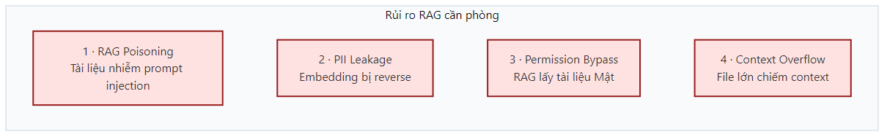

---

# Giải pháp: LLM local

Dữ liệu **KHÔNG** rời máy.

- **LLM local (Ollama)** là nền tảng → **RAG** lên trên

| Nhóm | Nhu cầu |
|---|---|
| **Văn phòng** | Tra quy chế nội bộ |
| **Lập trình viên** | Trợ lý code offline |
| **Tổ chức/DN** | Chatbot không rò rỉ |
| **Y tế** | Hồ sơ bệnh nhân bảo mật |

---

# Local vs Cloud

| Tiêu chí | Local | Cloud / API |
|---|---|---|
| **Bảo mật** | Ở lại máy | Gửi ra ngoài |
| **Chi phí** | Trả 1 lần | Theo token |
| **Chất lượng** | Model nhẹ | Mô hình mạnh |
| **Độ trễ** | Chậm trên CPU | Nhanh (GPU lớn) |
| **Vận hành** | Tự bảo trì | Bấm là dùng |

> Local thắng **bảo mật & chi phí**, đổi lấy **chất lượng & tốc độ**.

---

# Lộ trình buổi học

1. **Nền tảng:** cài & chạy LLM local — Ollama + Docker
2. **RAG — trọng tâm:** 6 thành phần → nạp tài liệu → **trích nguồn**

Cả 2 chặng đều có **thực hành làm theo**.

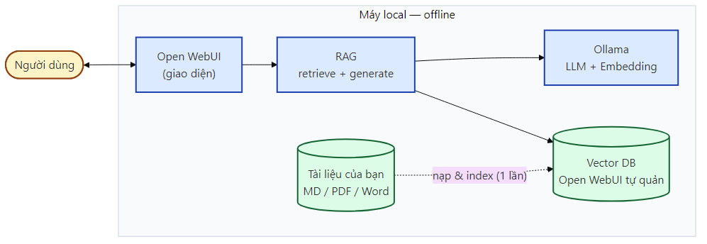

---

<!-- _class: divider -->

# RAG — Trục chính

---

# RAG là gì

**Tra** tài liệu trước, **trả lời** sau.

- **LLM** không có tài liệu của bạn
- Hỏi thẳng → **bịa** (hallucination)
- Dán cả tập → **vượt** context, tốn token
- Ẩn dụ: **đóng sách** (LLM) → **mở sách** (RAG)

> RAG = Retrieval + Augmented + Generation

---

# Kiến trúc RAG: 6 bước


**Offline** (1 lần): Load → Chunk → Embed → Store
**Online** (mỗi câu hỏi): Retrieve → Generate

> 4 bước đầu làm 1 lần · 2 bước cuối chạy mỗi câu hỏi.

---

# Embedding: chữ thành nghĩa


- Mỗi đoạn → vector **~768 chiều**
- Nghĩa gần → vector **gần** (cosine nhỏ)
- Hơn từ khoá: "mã đăng nhập" ≈ "mật khẩu" vẫn **khớp**
- Model **`nomic-embed-text`**, tính local

---

# Chunking, Vector DB, Top-k

- **Chunk** ~300–700 ký tự, overlap 10–20%
- **Vector DB**: vector + text + metadata, HNSW
- **Top-k**: lấy `k` đoạn gần nhất

| Thông số | Giá trị |
|---|---|
| Chunk Size | 500 |
| Chunk Overlap | 50 |
| Top K | 3 |

---

# Giới hạn & Đánh giá RAG

**RAG vẫn có thể sai khi:**
- Retrieve **sai đoạn** → "rác vào, rác ra"
- Câu hỏi **ngoài** tài liệu → cần System Prompt chặn
- **Chunking / embedding** kém → cả hệ kém theo

**Đánh giá chất lượng:**
- **Faithfulness** — câu trả lời bám nguồn, có trích dẫn
- Đọc **Sources** — nguồn không khớp = tín hiệu sai
- Khung bài bản: **RAGAS**

> Đo lường được → cải tiến được.

---

<!-- _class: divider -->

# Công cụ & chạy LLM local

---

# Ollama là gì

> Phần mềm mã nguồn mở, chạy LLM ngay trên máy — "Docker cho LLM".

- **Phổ biến**: kho model cộng đồng, nhiều model **hàng chục–trăm triệu lượt tải**
- **Chuyên nghiệp**: tự tối ưu GPU/CPU · API **tương thích OpenAI** → ghép app dễ
- **Bảo mật**: chạy **100% offline**
- **Đơn giản**: cài 1 lệnh, chạy/đổi model 1 dòng
- **Server**: chạy nền tại **`localhost:11434`** → Open WebUI nối vào

---

# Cài đặt Ollama

**Dễ nhất — tải từ web:** mở [ollama.com/download](https://ollama.com/download) → chọn hệ điều hành → tải về → chạy file cài đặt.

**Hoặc dòng lệnh — Windows** (PowerShell):
```powershell
winget install Ollama.Ollama
```

**macOS / Linux:**
```bash
curl -fsSL https://ollama.com/install.sh | sh
```

Kiểm tra: `ollama --version` · Yêu cầu **RAM ≥ 8GB**.

---

# Lấy model

Mở **[ollama.com/library](https://ollama.com/library)** → chọn model theo RAM máy:

| RAM | Model | Cỡ |
|---|---|---|
| **8GB** | qwen3:1.7b | ~1.4GB |
| **16GB** | qwen3:4b | ~2.5GB |
| **GPU lớn** | qwen3:8b | ~5GB |

Tải về (kèm embedding cho RAG):
```bash
ollama pull qwen3:1.7b
ollama pull nomic-embed-text
```

Số **"b"** ≈ độ thông minh ≈ độ nặng · **Qwen** hợp tiếng Việt. → Slide sau: đọc bảng **tag**.

---

# Chọn tag

Bấm vào model để xem bảng **tag** — chọn theo:

| Mục | Ý nghĩa |
|---|---|
| Size | nhỏ hơn RAM (8GB → ~5GB) |
| Q4 / Q8 | mức nén · Q4 nhẹ mà vẫn tốt |
| Context | cửa sổ nhớ 8K–256K · lớn = tốn RAM |
| :1.7b / :4b | số tham số ≈ độ nặng |

> Quy tắc vàng: chọn bản nhỏ hơn RAM, ưu tiên Q4.

---

<!-- _class: shot -->

# Thư viện model Ollama

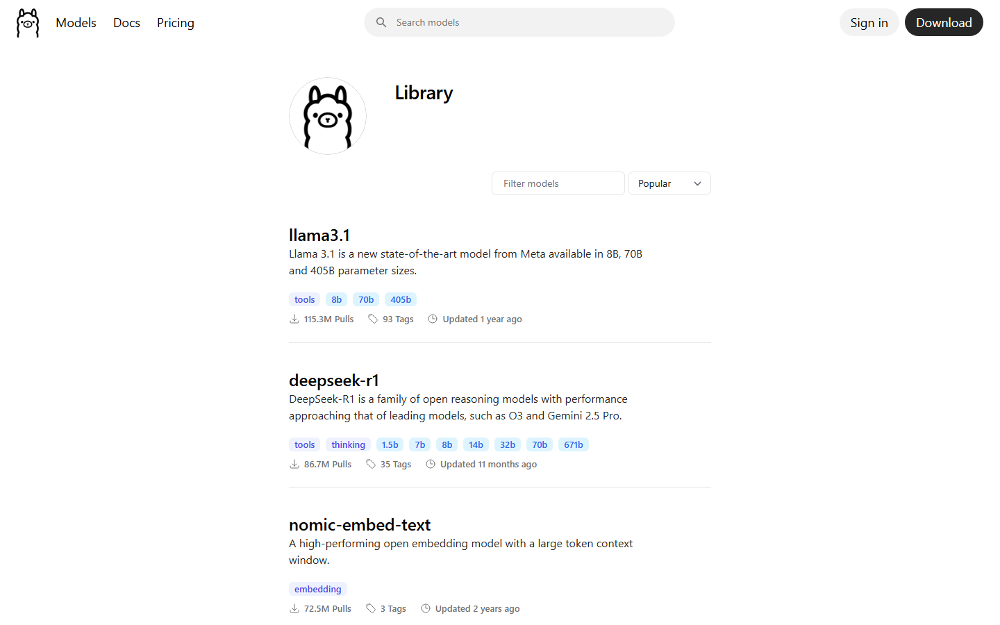

---

<!-- _class: shot -->

# Model qwen3 — chọn cỡ theo RAM

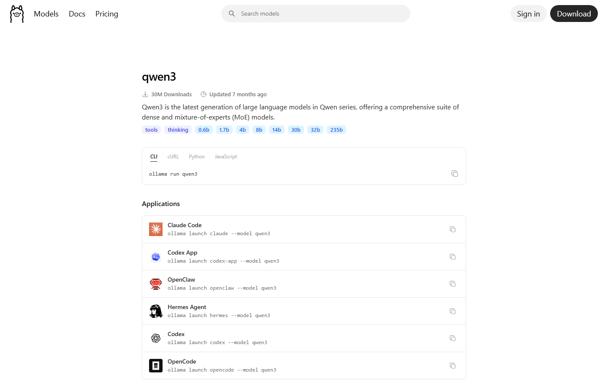

---

# Chạy & test LLM local

Test nhanh 1 câu:
```bash
ollama run qwen3:1.7b "Giải thích RAG trong 3 câu"
```

Hoặc mở phiên chat: `ollama run qwen3:1.7b` (dấu nhắc `>>>`, thoát `/bye`).

- Lần đầu **tự tải** model nếu chưa có → trả lời ngay
- **CPU** im 15–25s là bình thường (đang nạp) → sau đó **stream**
- Gửi **nhiều dòng**: bọc trong `""" … """`
- → Kết quả thật như **slide sau**

---

<!-- _class: shot -->

# Kết quả: LLM trả lời offline

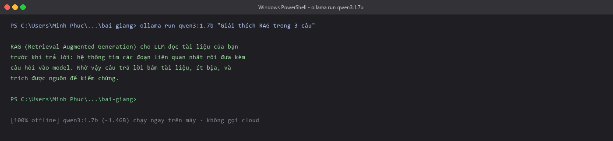

---

# Lệnh Ollama thường dùng

| Lệnh | Tác dụng |
|---|---|
| `ollama run qwen3` | Chạy / chat với model |
| `ollama pull qwen3` | Tải model về máy |
| `ollama list` | Liệt kê model đã tải |
| `ollama ps` | Xem model đang chạy |
| `ollama stop qwen3` | Dừng — giải phóng RAM |
| `ollama rm qwen3` | Xóa — giải phóng ổ đĩa |

> Quản model như quản app: tải · xem · dừng · gỡ.

---

<!-- _class: divider -->

# Thực hành — RAG qua Open WebUI

---

# Nhu cầu giao diện

- **LLM** local đã chạy, 6 bước RAG đã hiểu
- **Terminal** không hợp người dùng hằng ngày
- Cần **giao diện**: lịch sử chat, kéo-thả file, đổi model
- Giải pháp: **Open WebUI** — không cần code

---

# 6 bước trong Open WebUI

> Open WebUI tự động hóa 6 bước RAG — bạn chỉ chỉnh thông số.

| 6 bước | Trong Open WebUI |
|---|---|
| 1. Load | Upload / kéo-thả |
| 2. Chunk | Chunk Size |
| 3. Embed | Embedding Model |
| 4. Store | Tự động lưu |
| 5. Retrieve | Top K |
| 6. Generate | Model + Prompt |

---

# Open WebUI là gì

- Giao diện chat **mã nguồn mở**, giống ChatGPT, chạy local
- Lịch sử hội thoại, đổi model **1 click**, kéo-thả tài liệu
- Quản trị RAG bằng giao diện — **không cần code**
- Tài liệu + chat lưu volume `open-webui-data` → **không rời máy**

---

# Docker là gì

> Nền tảng **container** — đóng gói phần mềm + mọi thứ nó cần, chạy giống nhau ở mọi máy.

- **Chuẩn công nghiệp**: hầu hết hệ thống production hiện đại dùng Docker
- **Phổ biến**: hàng triệu lập trình viên · kho image khổng lồ (Docker Hub)
- **Gọn & sạch**: 1 lệnh là có cả Open WebUI · gỡ không để lại rác
- **An toàn**: chạy **cách ly** (isolated), không đụng hệ thống máy bạn

---

# Cài đặt Docker

Tải **Docker Desktop** (miễn phí cá nhân): [docker.com/products/docker-desktop](https://www.docker.com/products/docker-desktop/)

**Windows** — cần `winget` (sẵn trên Win 10/11):
```powershell
winget install Docker.DockerDesktop
```

**macOS** — cần **Homebrew** trước (mặc định chưa có → cài tại [brew.sh](https://brew.sh)):
```bash
brew install --cask docker
```

Cài xong → mở **Docker Desktop**, đợi báo "running".

---

# Cài đặt Open WebUI

Docker Desktop phải đang **"running"**. Chọn **1** cách.

**Cách 1 — Docker (cấu hình sẵn của repo):** chạy **trong thư mục repo**:
```powershell
docker compose up -d
```
**Cách 1b — Docker (cài độc lập, không có repo):**
```powershell
docker run -d -p 3000:8080 --add-host=host.docker.internal:host-gateway `
  -v open-webui:/app/backend/data --name open-webui ghcr.io/open-webui/open-webui:main
```
→ mở [localhost:3000](http://localhost:3000) · lần đầu tải image ~1GB

**Cách 2 — pip (không cần Docker):**
```bash
pip install open-webui
open-webui serve          # → mở localhost:8080
```

---

# Khởi động & mở

Kiểm tra trước khi mở:
```bash
ollama list
docker ps
```

Mở **[localhost:3000](http://localhost:3000)** → chọn model **qwen3:1.7b**. Open WebUI **tự nối Ollama** (Settings → Connections).
→ Giao diện & kết nối như **2 slide sau**.

---

<!-- _class: shot -->

# Giao diện Open WebUI

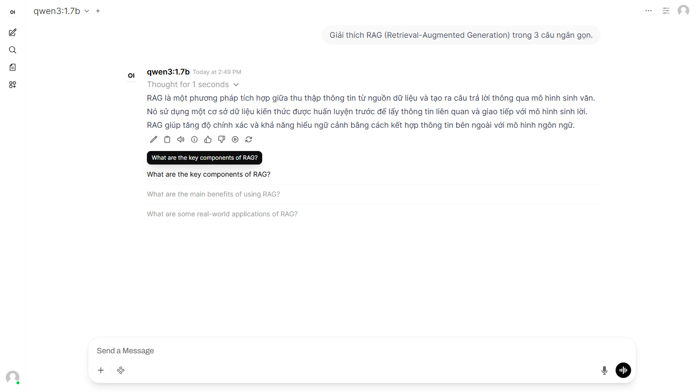

---

<!-- _class: shot -->

# Kết nối Ollama với Open WebUI

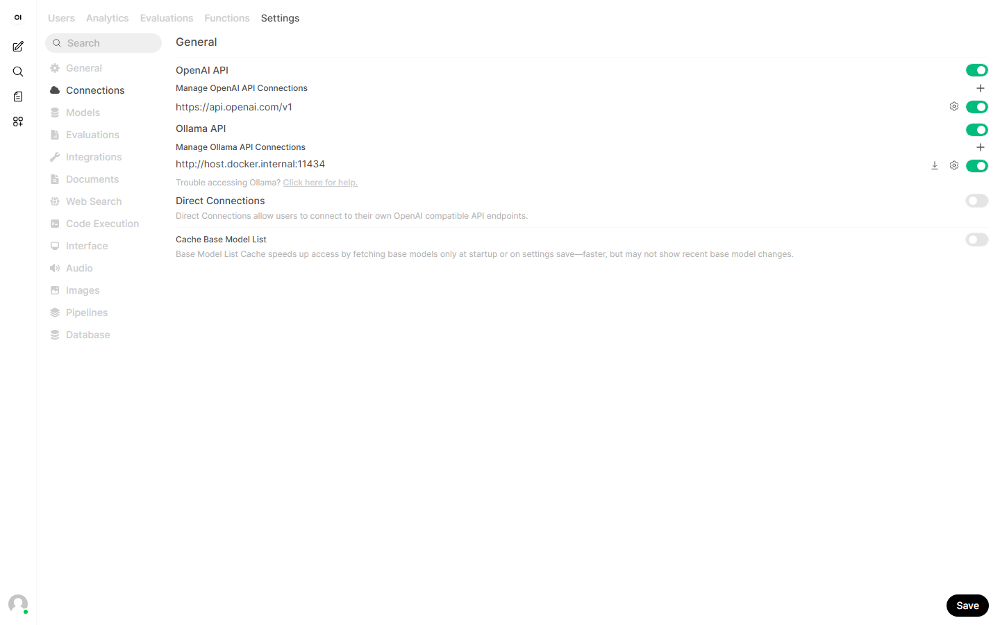

---

# Nạp tài liệu · Bước 1: Load

Tạo **Knowledge base** = kho tài liệu của bạn (dùng lại nhiều lần):
1. Vào **Workspace → Knowledge → + New Knowledge**
2. Đặt tên kho → bấm **Create**
3. Mở kho → bấm **+** → upload file (.md, .pdf, .docx)

→ 2 slide sau: **màn tạo kho** & **kho đã có 6 tài liệu**.

---

<!-- _class: shot -->

# Tạo Knowledge base

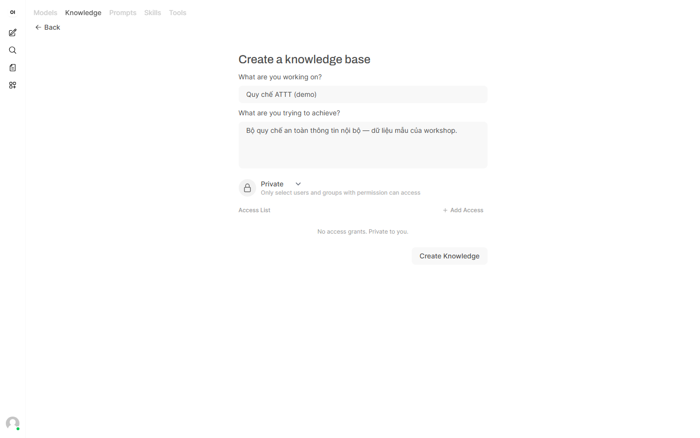

---

<!-- _class: shot -->

# Kho "Quy chế ATTT" — 6 tài liệu

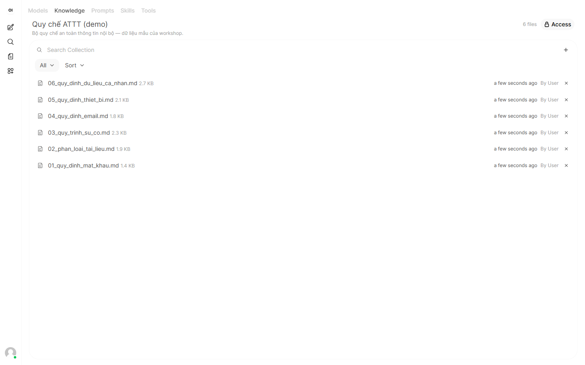

---

# Chỉnh thông số · Bước 2–3–5

Vào **Admin Panel → Settings → Documents**:

| Tên | Giá trị |
|---|---|
| Chunk Size | ~500 |
| Chunk Overlap | ~50 |
| Embedding Model | nomic-embed-text |
| Top K | 3 |
| Hybrid Search | bật cho mã / từ khóa hiếm |

→ Bấm **Save** rồi nạp lại tài liệu. 2 slide sau: **mặc định** → **sau khi đổi nomic**.

---

<!-- _class: shot -->

# Settings → Documents (mặc định)

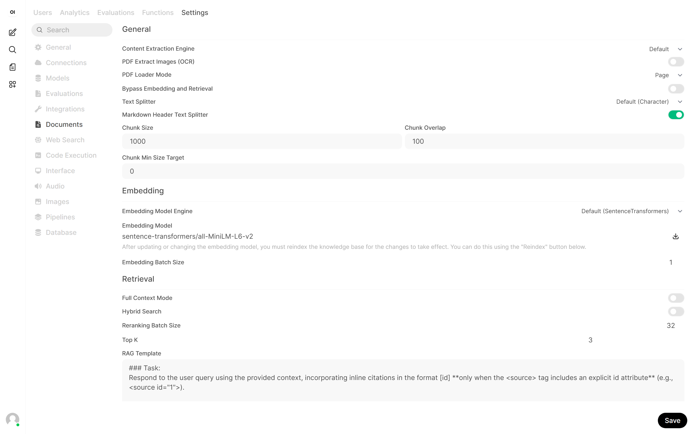

---

<!-- _class: shot -->

# Đổi Embedding → nomic-embed-text

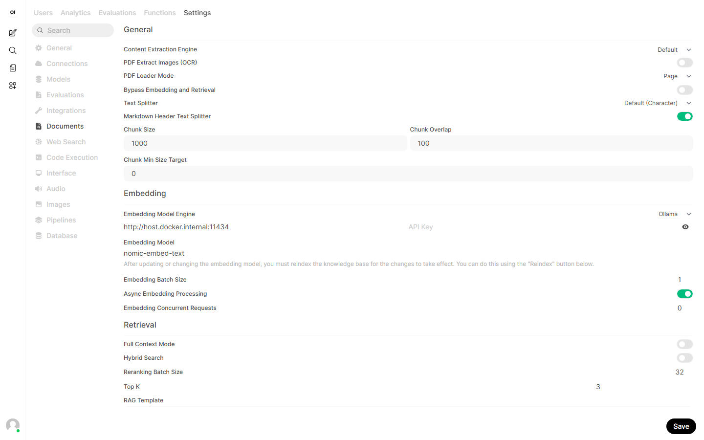

---

# Trợ lý RAG · Bước 6: Generate

Tạo **model trợ lý riêng** (Workspace → Models → +):
- **Base model** `qwen3:1.7b` + **System Prompt** = bước *Generate*
- System Prompt: *chỉ dùng tài liệu · thiếu → "không đề cập" · trích nguồn*
- **Gắn Knowledge base** vào model → khỏi gõ `#` mỗi lần
- Lưu thành **trợ lý** → chọn 1 click, dùng lại mọi lúc

→ Slide sau: trợ lý "Quy chế ATTT" với Prompt + Knowledge.

---

<!-- _class: shot -->

# Trợ lý "Quy chế ATTT": Prompt + Knowledge

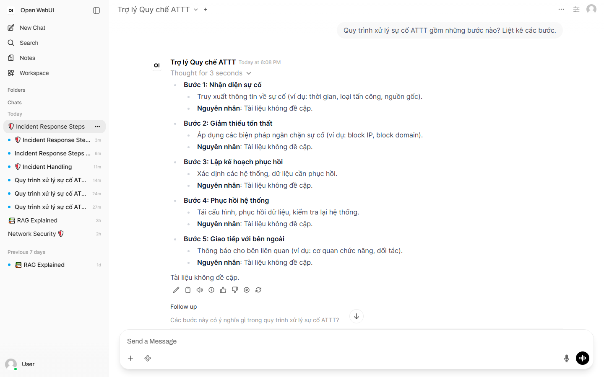

---

# Hỏi đáp có trích nguồn

Chọn **trợ lý** vừa tạo → hỏi:
```text
Quy trình xử lý sự cố ATTT gồm những bước nào?
```

- Trả lời **bám tài liệu**, không bịa
- **Trích nguồn**: hiện tên file → bấm xem đúng đoạn gốc
- **Kiểm chứng được** — khác biệt cốt lõi với ChatGPT thường

→ 2 slide sau: **truy hồi nguồn** → **câu trả lời có trích dẫn**.

---

<!-- _class: shot -->

# Retrieve: truy hồi đúng nguồn

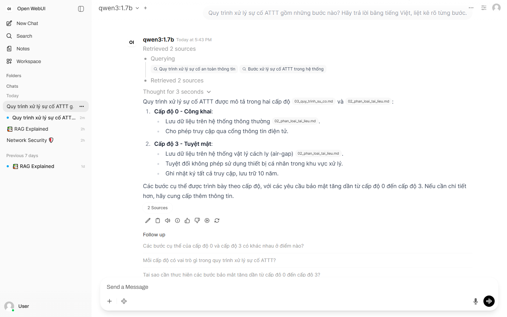

---

<!-- _class: shot -->

# Trả lời kèm trích nguồn

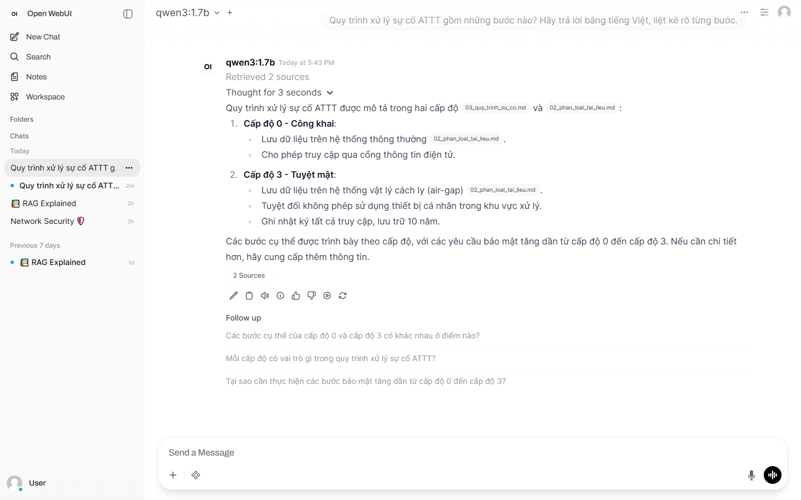

---

# Tinh chỉnh & kiểm chứng

- **Top K** 3 → 5: đầy đặn hơn, chậm hơn
- **Model** 1.7b → 4b: mạch lạc hơn
- **Từ tự nhiên** hợp hơn mã ngắn (P1, MFA)
- Hỏi câu **ngoài** tài liệu → *"Tài liệu không đề cập"* = RAG đúng

---

<!-- _class: divider -->

# Áp dụng & Tổng kết

---

# Thành quả buổi học

- Chạy **LLM** offline — dữ liệu không rời máy
- Xây **RAG** local trên tài liệu của mình
- Trả lời **có trích nguồn** — không cần code


> Hệ RAG local — tự xây, không cloud.

---

# Áp dụng trong tổ chức

| Dữ liệu | Mục đích | Chọn |
|---|---|---|
| **Nhạy** | Tra cứu nội bộ | **Local** |
| **Nhạy** | Tác vụ phức tạp | **Local** (4b/8b) |
| Công khai | Chất lượng tối đa | Cloud |

> Dữ liệu càng nhạy → ưu tiên Local.

Use case: **HR** · **Pháp chế** · **R&D** · **CSKH**

---

# Checklist bảo mật

- **Phân loại** tài liệu trước khi nạp
- **Redact** PII trước khi index
- **Phân quyền** — WEBUI_AUTH, mỗi người 1 tài khoản
- **Audit log** — ai hỏi gì, truy vấn tài liệu nào


---

<!-- _class: lead -->

# Cảm ơn!

## Bạn đã tự xây một hệ RAG local — dữ liệu không rời máy

Hỏi đáp  ·  PGS.TS. Lê Anh Cường
