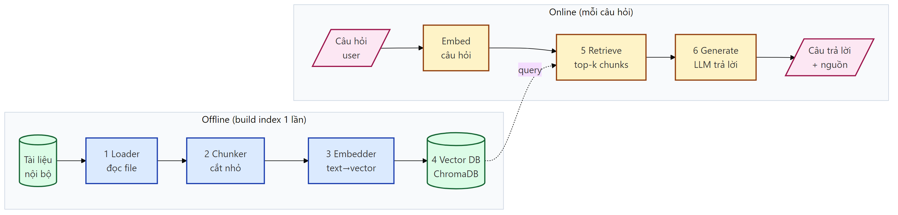
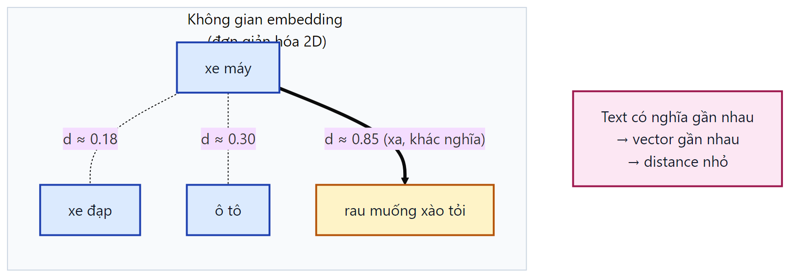
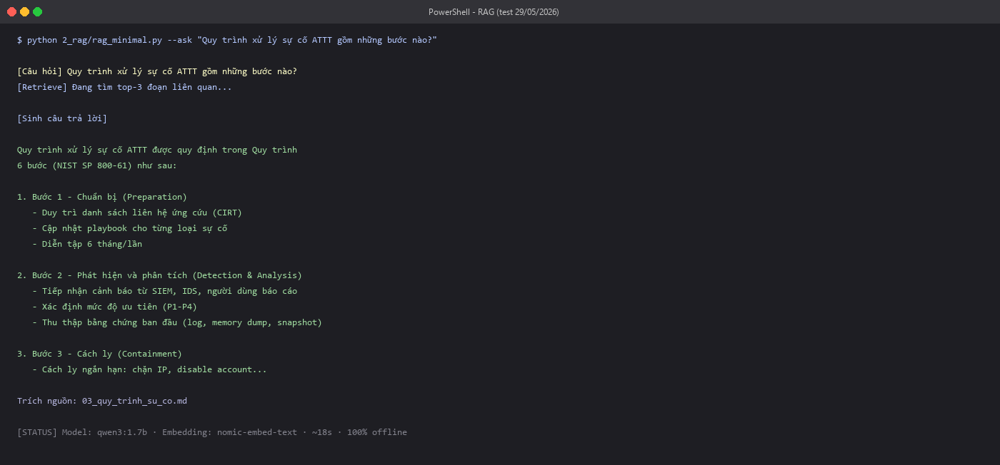
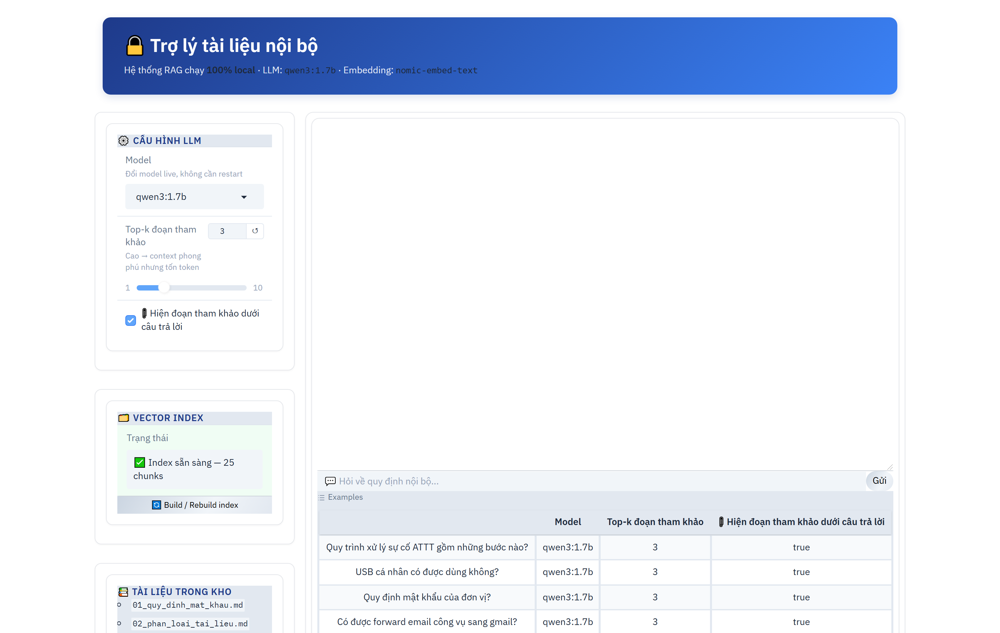
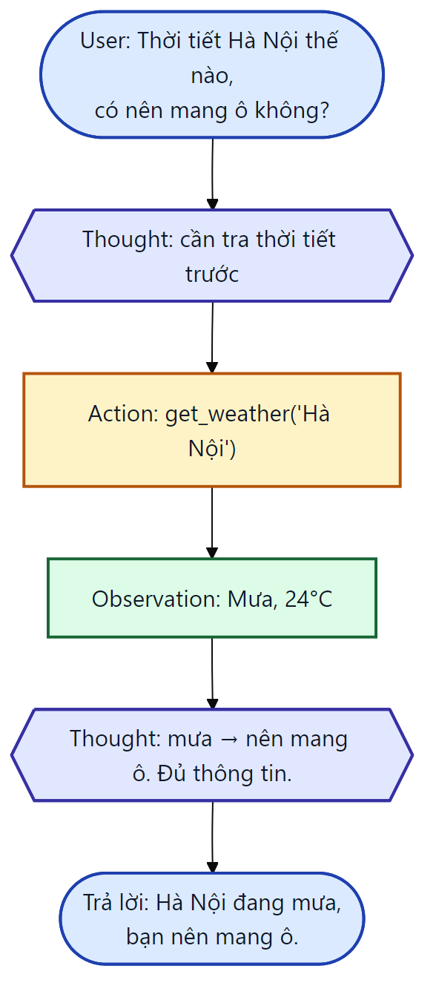
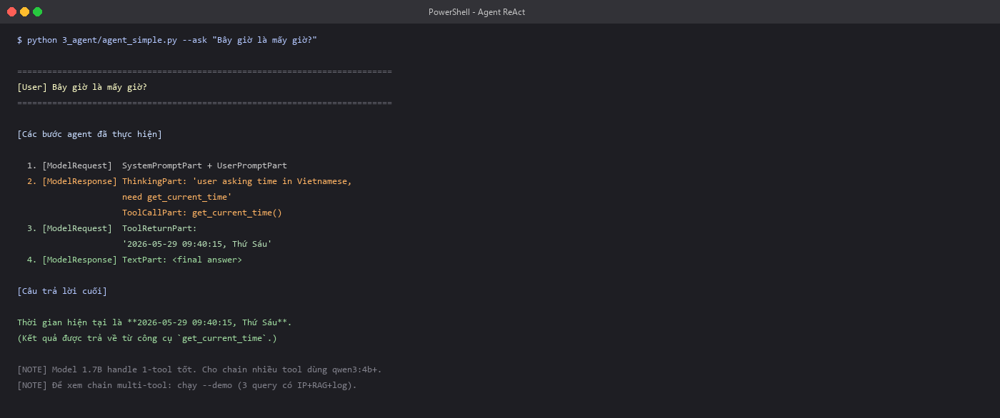

<!-- _class: lead -->

# Local LLM · RAG · Agent

## Trợ lý AI chạy 100% trên máy của bạn

<br>

**2 giờ · 3 module · Hands-on · Không byte nào rời máy**

---

# Vì sao chạy LLM trên máy mình?

<div class="columns-3">

<div>

### 🔒 Riêng tư
Dữ liệu **không rời máy** — hợp đồng, mã nguồn, hồ sơ, bài tập

</div>

<div>

### 🌐 Độc lập
Pull về xong → **offline vẫn chạy**, không phụ thuộc mạng/nhà cung cấp

</div>

<div>

### 💰 Miễn phí
Không token, không giới hạn, không hoá đơn theo lượt gọi

</div>

</div>

<br>

<div class="highlight">

**Trục xuyên suốt buổi học**: mỗi lần bạn dán nội dung vào ChatGPT, nó rời khỏi máy bạn lên server công ty khác. Local LLM cho bạn đúng năng lực đó — **không gửi đi đâu cả**.

</div>

---

# Bạn thấy mình trong đó chứ?

<div class="columns">

<div>

- **Văn phòng** → hợp đồng, bảng lương, danh sách khách hàng
- **Lập trình viên** → mã nguồn nội bộ, API key
- **Nhà nghiên cứu** → dữ liệu, bản thảo chưa công bố

</div>

<div>

- **Sinh viên** → đồ án, bài tập của mình
- **Y tế / pháp lý** → hồ sơ bệnh án, hồ sơ thân chủ
- **Tổ chức** → tài liệu nội bộ nhạy cảm

</div>

</div>

<br>

<div class="success-box">

**Bằng chứng vật lý** (demo giữa buổi): tắt Wi-Fi → AI **vẫn trả lời**. Không mạng, không cloud, không gửi đi đâu.

</div>

---

# Roadmap — 3 module, trọng số rõ ràng

| Phần | Vai trò | Thời lượng |
|---|---|---|
| **1. Local LLM với Ollama** | ⭐ **Trục chính** | **44'** (giảng + thực hành kỹ) |
| 2. RAG cho tài liệu của bạn | Thứ yếu, quan trọng | 34' (lý thuyết gọn + thực hành) |
| 3. Agent | Giới thiệu — về tự khám phá | 18' (chỉ demo) |

<br>

> *Local LLM (chạy được) → RAG (cho LLM đọc tài liệu của bạn) → Agent (cho LLM biết hành động)*

---

<!-- _class: divider -->

## Phần 1 / 3 · Trục chính

# Local LLM với Ollama

---

# Ollama = "Docker cho LLM"

<div class="columns">

<div>

### Docker
```bash
docker pull nginx
docker run nginx
```

### Ollama
```bash
ollama pull qwen3:1.7b
ollama run qwen3:1.7b
```

</div>

<div>

### Ẩn hết phần khó:
- ❌ Không cần biết CUDA
- ❌ Không cần config VRAM
- ❌ Không cần quản batching
- ❌ Không cần compile

### Chính thức:
[ollama.com](https://ollama.com) · 90K+ ⭐

</div>

</div>

---

# 5 ưu điểm nhớ ngay

<div class="columns">

<div>

### 1️⃣ Cài 1 lệnh
```bash
winget install Ollama.Ollama
```

### 2️⃣ Tự tối ưu phần cứng
Auto detect GPU/CPU, không cần config

### 3️⃣ Đổi model 1 dòng
```python
ollama.chat(model="qwen3:1.7b")
# → ollama.chat(model="qwen3:4b")
```

</div>

<div>

### 4️⃣ API tương thích OpenAI
```python
client = OpenAI(
  base_url="http://localhost:11434/v1",
  api_key="ollama"
)
```
→ **Không khoá cứng vào 1 nhà cung cấp**

### 5️⃣ Offline 100%
Pull về xong → **tắt mạng vẫn chạy**

</div>

</div>

---

# Demo: 5 dòng code = LLM chạy local

```python
import ollama

response = ollama.chat(
    model="qwen3:1.7b",
    messages=[
        {"role": "system", "content": "Bạn là trợ lý hữu ích, trả lời ngắn gọn."},
        {"role": "user", "content": "Giải thích RAG trong 3 câu."},
    ],
    think=False,   # tắt thinking mode của Qwen3 → output sạch
)
print(response.message.content)
```

<div class="success-box">

**Chạy là có ngay câu trả lời** — không cần CUDA, không cần quản VRAM. Xem thêm ở demo RAG (slide sau) + notebook Module 1.

</div>

---

# Chọn model theo MÁY của bạn

| RAM máy | Model gợi ý | Size | Tốc độ CPU |
|---|---|---|---|
| 8 GB | **qwen3:1.7b** ⭐ | 1.4 GB | **73 tok/s** |
| 16 GB | qwen3:4b | 2.5 GB | ~77 tok/s |
| 16 GB+ | llama3.2:3b | 2.0 GB | ~60 tok/s |
| GPU / 32 GB | qwen3:8b | 5.2 GB | ~40 tok/s |

<br>

<div class="highlight">

**Quantization** (Q4): nén model xuống 4-bit → nhẹ 4× mà giữ ~97% chất lượng. Đó là lý do model 7 tỷ tham số chạy được trên laptop 8 GB. **Đổi model = đổi 1 string.**

</div>

---

# Bản đồ thuật ngữ (cho người mới)

| Thuật ngữ | Hiểu nôm na |
|---|---|
| **Model** | "Bộ não" AI đã huấn luyện sẵn (file vài GB) |
| **Token** | Mẩu chữ (~¾ từ). LLM sinh từng token một |
| **Tham số (1.7B, 4B...)** | Số "nơ-ron" — càng nhiều càng thông minh & nặng |
| **Embedding** | Biến chữ thành dãy số để máy so sánh nghĩa |
| **Temperature** | 0 = chắc chắn, nhất quán · 1 = sáng tạo, ngẫu nhiên |
| **Context window** | "Trí nhớ ngắn hạn" — số token model đọc được 1 lần |

> Không cần thuộc lòng — tra lại bảng này khi gặp trong code.

---

# 🛠️ Thực hành Phần 1 · 22 phút

### Thành quả: *"LLM chạy offline trên máy TÔI"*

<br>

1. `ollama --version` + `ollama list` — kiểm tra cài
2. `ollama run qwen3:1.7b` → hỏi 1 câu **chủ đề của bạn**
3. Notebook Python 5 dòng → đổi system prompt thành persona riêng
4. **Sửa Modelfile** → build model "của bạn" (tính cách + trả lời ngắn)
5. (Thêm) chỉnh `temperature` thấp ↔ cao, quan sát khác biệt

---

<!-- _class: divider -->

## Phần 2 / 3 · Thứ yếu nhưng quan trọng

# RAG — cho LLM đọc tài liệu của bạn

---

# Bài toán: AI không biết tài liệu của BẠN

<div class="warning-box">

Bạn có một đống tài liệu của riêng mình — sổ tay, quy trình, ghi chú, giáo trình.
**ChatGPT không biết gì về chúng.** Và bạn cũng không muốn upload hết lên cloud.

</div>

<br>

<div class="columns">

<div>

### ❌ LLM thuần
"Hỏi một người thông minh **nhưng không biết** tài liệu của bạn"
→ trả lời chung chung / bịa

</div>

<div>

### ✅ LLM + RAG
"Cho người đó **tra tài liệu của bạn trước** khi trả lời"
→ bám sát tài liệu thật, **trích nguồn**

</div>

</div>

---

# RAG pipeline — 5 bước



**Offline** (build 1 lần):

1. **Load** — đọc tài liệu
2. **Chunk** — cắt ~500 ký tự
3. **Embed** — text → vector
4. **Store** — lưu vector DB

**Online** (mỗi câu hỏi):

5. **Retrieve** — tìm top-k đoạn
6. **Generate** — LLM trả lời + nguồn

---

# Embedding — bước "ma thuật"



Model ánh xạ **text → vector** ~768 chiều

<br>

**Quy tắc**:
text có nghĩa **gần nhau**
→ vector **gần nhau**

<br>

<div class="highlight">

Hỏi "xe đạp" tìm được "xe máy" (gần nghĩa), không tìm "rau muống". **Keyword search sẽ trượt — embedding thì hiểu nghĩa.**

</div>

---

# Demo RAG

<div class="columns">

<div>



*Kết quả trên terminal*

</div>

<div>



*Giao diện Gradio*

</div>

</div>

**~80 dòng Gradio** = chat UI streaming + chọn model + **trích nguồn từng câu trả lời**

---

# 🛠️ Thực hành Phần 2 · 19 phút

### Thành quả: *"AI đọc tài liệu CỦA TÔI"*

<br>

1. Chạy notebook RAG trên dataset mẫu → thấy trích nguồn
2. ⭐ **Thả 1-2 file của riêng bạn** (`.md`/`.txt`) vào `data/`, build lại, hỏi → AI trả lời theo tài liệu của chính bạn _(chưa mang file? dùng `sample_upload/`)_
3. Đổi `CHUNK_SIZE` 200 / 500 / 1000 → so kết quả (hiểu chunking)
4. (Bảo mật nhẹ) thả file chứa câu "lừa" → xem RAG có bị dẫn dắt không

> 💬 Hỏi thử (chạy chắc): *"Quy trình xử lý sự cố ATTT?"* · *"USB cá nhân có được dùng không?"*

---

<!-- _class: divider -->

## Phần 3 / 3 · Giới thiệu

# Agent — cho LLM biết hành động

### (Demo hôm nay — thực hành về tự khám phá)

---

# Agent = LLM + Tools + ReAct loop

<div class="columns">

<div>

**Giới hạn RAG**: chỉ tra → trả lời, **không hành động**

**Agent** tự quyết gọi tool nào, dừng khi nào:

1. **Thought** — cần gì tiếp?
2. **Action** — gọi `tool(args)`
3. **Observation** — kết quả → lặp

<br>

> Tool = function Python bất kỳ.
> Paper gốc: **ReAct** (Princeton + Google, 2022)

</div>

<div class="center">



</div>

</div>

---

# Demo Agent



<div class="columns">

<div>

✅ **Hôm nay**: chỉ cần **thấy** agent hoạt động & hiểu nó khác RAG ở chỗ **biết hành động**

</div>

<div>

🏠 **Về nhà**: thêm tool của bạn, thử multi-tool với model 4B+, đọc `log_reader.py` để hiểu **tool tự bảo vệ**

</div>

</div>

---

# Sau 2 giờ bạn đã làm được

<div class="success-box">

✅ **LLM chạy 100% offline** trên máy của bạn

✅ **Chatbot đọc tài liệu của bạn**, có trích nguồn

✅ **Thấy agent hành động** — và có repo để tự nghịch tiếp

</div>

<br>

### 3 việc làm tuần này

1. Làm RAG cho **tài liệu thật** của bạn
2. Thử **model khác** xem hợp máy mình không
3. Đọc handbook phần bạn quan tâm (RAG nâng cao / Agent / bảo mật)

---

# Một điểm bảo mật để mang về

<div class="highlight">

**Khi cho AI quyền đọc file / gọi công cụ → AI có thể bị "lừa".**
Vì vậy công cụ phải **tự giới hạn mình** (sandbox), đừng tin LLM mù quáng.
Đúng cho mọi app AI — không riêng lĩnh vực nào.

</div>

<br>

**Đọc thêm trong handbook** (đã cắt khỏi giờ giảng để gọn):
RAG poisoning · PII trong embedding · bảo mật agent · roadmap production (vLLM, Qdrant, MCP) · khi nào KHÔNG nên dùng local.

---

<!-- _class: lead -->

# Cảm ơn các bạn

## Q&A — thảo luận

<br>

📚 Repo: code + handbook + dataset mẫu + slide này

🛡️ Trục cốt lõi: **dữ liệu của bạn không rời máy**

🚀 Fork repo → thay tài liệu của bạn → build trợ lý của riêng mình
